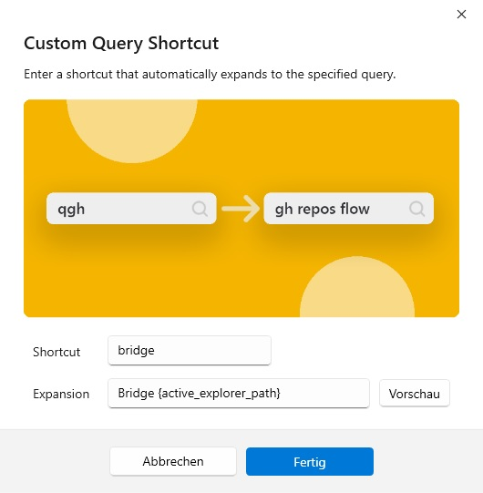

# Adobe-Bridge-CS5-FlowLauncher-Starter
AutoHotkey starter script to make Adobe Bridge CS5 and [FlowLauncher](https://www.flowlauncher.com/) compatible with each other.

Adobe Bridge CS5 can be started with a path to open a folder directly. However, there is a small issue with umlauts and the [Plugin Runner](https://github.com/jjw24/Wox.Plugin.Runner) plugin, so this script tries to make the two more compatible.

First you need to download the AutoHotkey script from this repository. Please make sure not just to copy and paste its contents, as the script needs to be encoded as UTF8 with the [Byte Order Mark](https://en.wikipedia.org/wiki/Byte_order_mark) set.

Next, install the [Plugin Runner](https://github.com/jjw24/Wox.Plugin.Runner) plugin for [FlowLauncher](https://www.flowlauncher.com/). Set the path to the AutoHotkey script and the arguments to `{*}`.

Then, create a new keyboard combination in [FlowLauncher](https://www.flowlauncher.com/) that expands to the shortcut you defined in the [Plugin Runner](https://github.com/jjw24/Wox.Plugin.Runner) followed by `{active_explorer_path}`, e.g. .

Please note that the `{active_explorer_path}` doesn’t seem to get updated automatically, e.g. if you close the [FlowLauncher](https://www.flowlauncher.com/) window and open it again, it will not update to reflect the new path.

If you have any additional special characters that you need to encode, uncomment line 34 in the AutoHotkey script and open an issue with the special character and the encoded version output by the message box.
